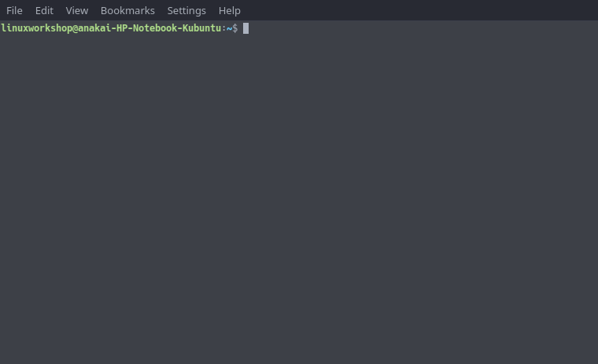

<!-- START doctoc generated TOC please keep comment here to allow auto update -->
<!-- DON'T EDIT THIS SECTION, INSTEAD RE-RUN doctoc TO UPDATE -->

# Table of Contents

- [Why Linux?](#why-linux)
  - [Linux is all around us](#linux-is-all-around-us)
  - [Linux Expertise being a desired skill](#linux-expertise-being-a-desired-skill)
- [A First Look](#a-first-look)
- [Useful Commands](#useful-commands)
  - [`cd`](#cd)
  - [`ls`](#ls)
  - [`man`](#man)
  - [`mkdir`](#mkdir)
  - [`rm` and `rmdir`](#rm-and-rmdir)
  - [`cat`](#cat)
  - [`grep`](#grep)
  - [`cp`](#cp)
  - [`mv`](#mv)
  - [`touch`](#touch)
  - [`locate` and `find`](#locate-and-find)
  - [`df`](#df)
  - [`du`](#du)
  - [`tar`, `zip`, `unzip`](#tar-zip-unzip)
  - [`ps`](#ps)
  - [`kill`](#kill)
- [Chaining Commands](#chaining-commands)
  - [`;`,`|`, `&` and `&&`](#--and-)
- [Variables and Environment Variables](#variables-and-environment-variables)
  - [A brief introduction to variables](#a-brief-introduction-to-variables)
  - [Regular (Shell) variables vs Environment Variables](#regular-shell-variables-vs-environment-variables)
  - [Viewing environment and shell variables](#viewing-environment-and-shell-variables)
  - [Setting Environment and Shell Variables](#setting-environment-and-shell-variables)
  - [Unsetting environment and shell variables](#unsetting-environment-and-shell-variables)

<!-- END doctoc generated TOC please keep comment here to allow auto update -->

# Why Linux?

Now you may be wondering, why would I even need to learn to use a different operating system, much less commands in a terminal on an unknown system?

## Linux is all around us

First of all, a lot of the software architecture we used to day is built upon linux, from the operating system on many of our mobile devices (Android), all the way to cloud architecture relying on linux.

Now the primary reason for this is due to the reliability, stability and security offered out of the box.

## Linux Expertise being a desired skill

And the best part is, learning how to use linux could actually help you to improve your employability in the job market.

Whether your prospective job will require you to manage a company's server, or develop their cloud architecture, potential employers are crying out for people who know the ins and outs of Linux.

# A First Look

When you open a terminal application you would see something like this:



Let's take a closer look at this line:


The format is `username@computer-name:filepath$`

The `$` at the end represents that linuxworkshop is just a regular user. The root(a superuser) have a pound sign.


_Note that in order for a regular user that has administrative privledges to do administrative tasks they must use `sudo`._

without sudo:


with sudo:


When you use sudo for the first time in a terminal session, you will need to enter your password. For a while, subsequent sudo commands won't require a password.

So, the part after the semi-colon is the file path. `~` actually represents the path to the current users home directory. This will generally be `/home/username`.

`/` by itself is the root of the file system similar to `C:` in Windows.

The `pwd` command prints the path of your current working directory.


# Useful Commands

## `cd`

This command is mainly used for navigating through directories

```bash
$ cd ..
$ cd /
$ cd ~
$ cd
$ cd -
```

## `ls`

The linux equivalent of the `dir` command with colour coding.

```bash
$ ls
$ ls -a
$ ls -R
$ ls -al
```

## `man`

This serves as a user manual for all commands on your system.

So if we were to run the following:

```bash
$ man ls

```

It would give a breakdown of how the command `ls` is used

## `mkdir`


## `rm` and `rmdir`

`rmdir` is a command used for removing empty directories and `rm` on its own is used for removing files.

However, if you'd like to remove all of the files within a directory, and the directory you could also use the `rm` command with one of its flags as seen below

```bash
$ rmdir <some-empty-dir>
$ rm <some-file>
$ rm -r <some-dir-with-files>
```

## `cat`


## `grep`

The grep command is used to search text. It searches the given file for lines containing a match to the given strings or words.


p.s) You can also use regex with grep ^\_^

## `cp`

cp stands for copy. This command is used to copy files or group of files or directory. It creates an exact image of a file on a disk with different file name. cp command requires at least two filenames in its arguments.

Usage

```bash
$ cp <file-name> <directory-name>
```

Example


## `mv`

Moving and renaming files.

## `touch`

It is used to create a file without any content. .

## `locate` and `find`

`find` is used for recursively traversing your system and searching for desired file/s.

`locate` is another utility used for searching your system for desired files through checking a local database of the files on your system.

```bash

```

## `df`

show a disk usage report

## `du`

show the size of a file or folder

## `tar`, `zip`, `unzip`

## `ps`

similar to task manager on windows, ps is a utility used for showing information related to status on your system.

a few flags that this command has are

```bash
$ ps a
$ ps u
$ ps aux

```

## `kill`

Similar to the `End Task` feature in task manager on windows, the kill command allows you to immediately terminate a running process on your system

# Chaining Commands

## `;`,`|`, `&` and `&&`

`;` - run the commands one after the other regardless of whether the previous command ran successfully.

`&&` - run the next command only if the previous command ran successfully.

`|` - execute the preceding statement and connect its output to the input of the proceeding statement

`&` - run first process in background

# Variables and Environment Variables

- regular variables vs environment variables
- viewing variables
- setting and unsetting variables

## A brief introduction to variables

Normally variables have the following format:

```bash
KEY=value
KEY="fancy value"
KEY=value1:value2
```

Where the variable names are case sensitive and by convention, environment variables should have their names in **uppercase** characters.

There should not be space around the equal sign and to assign multiple values to the variable you would use the colon `:`.

## Regular (Shell) variables vs Environment Variables

So variables can be considered into two main categories, environment variables and shell variables.

**Environment variables** are system wide variables, whilst **Shell variables** are usually only available within the current shell/terminal instance.

## Viewing environment and shell variables

If you'd like to take a look at your environment variables run the following command:

```bash
$ printenv
```

Or if you'd like to print specific variables you could specify the name

```bash
$ printenv SHELL
```

and your output should turn out to be

```
/bin/bash
```

**But what about shell variables?**

So to view shell variables you could use the `set` command

```bash
$ set
```

This might be a large list, so I'd recommend chaining this command with the `|` (pipe) symbol with a command such as `less`

```bash
$ set | less
```

## Setting Environment and Shell Variables

So this is actually a pretty simple task. We'll begin by defining a shell variable

```bash
$ DEMO_VAR='Variables can be pretty useful'
```

Now we can see our variable by chaining the `set` command with grep

```bash
$ set | grep DEMO_VAR
```

Output:

```bash
DEMO_VAR='Variables can be pretty useful'
```

But since this is a shell variable, we won't be able to use it in another bash shell.

Let's test this now actually, by using the `bash` command to create a child shell.

```bash
$ bash
$ echo $DEMO_VAR
```

Now we should get no output. However if we were to make this an environment variable we would obtain output.

So to create an environment variable we'll do the following:

```bash
$ export DEMO_VAR
```

and we can test for it by doing? (A question could be asked here in the workshop)

```bash
$ printenv | grep DEMO_VAR
```

Now that's everything for setting variables, but what about unsetting them?

## Unsetting environment and shell variables

So using our same `DEMO_VAR` variable, we can use the `unset` command.

```bash
$ unset DEMO_VAR
```

and if we were to test for it by using the `echo` command we should get no output.
